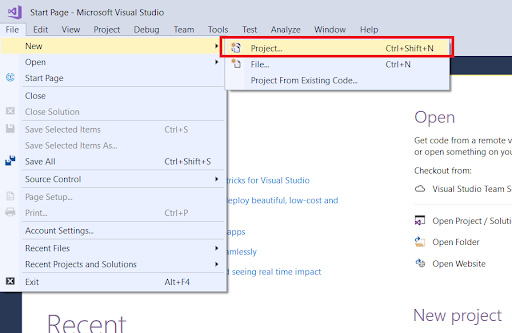
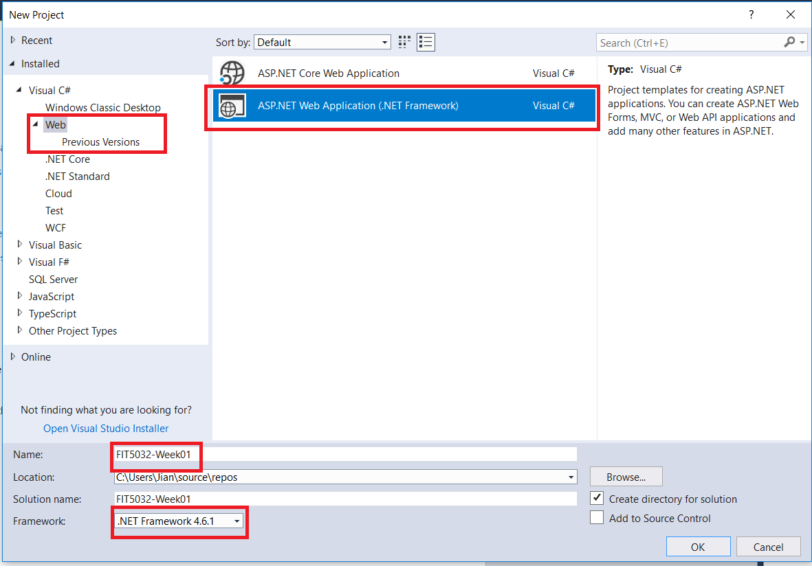

# FIT5032 - Internet Applications Development
## Week 01 - HouseKeeping & Introduction to Visual Studio 2017

Last updated: **20th August 2018**

Author: Jian Liew

<!-- TOC -->

- [FIT5032 - Internet Applications Development](#fit5032---internet-applications-development)
    - [Week 01 - HouseKeeping & Introduction to Visual Studio 2017](#week-01---housekeeping--introduction-to-visual-studio-2017)
    - [**Housekeeping**](#housekeeping)
    - [**Recommended Structure**](#recommended-structure)
    - [Setting Up Your Own Development Environment](#setting-up-your-own-development-environment)
    - [Tutorial Structure](#tutorial-structure)
    - [**Objectives**](#objectives)
    - [DoubtFire Submission](#doubtfire-submission)
    - [General Reminder](#general-reminder)
    - [Microsoft Visual Studio](#microsoft-visual-studio)
    - [**Project and Solution**](#project-and-solution)
        - [Project](#project)
        - [Solution](#solution)
    - [Features of an Enterprise Level IDE](#features-of-an-enterprise-level-ide)
    - [Useful Hotkeys](#useful-hotkeys)
    - [IntelliSense](#intellisense)
    - [Getting Started with a Visual Studio .NET MVC Project](#getting-started-with-a-visual-studio-net-mvc-project)
        - [Step 1 - Starting a new Project](#step-1---starting-a-new-project)
        - [Step 2](#step-2)

<!-- /TOC -->

## **Housekeeping**

Before we begin, it is highly recommended for you to use your own personal computer for this subject. If you are planning to use the Monash computers, it is highly recommended to save all your work properly. Towards, the end of the semester, there will be a portfolio submission where you need to showcase all the work you have done so far. To prevent difficulties during this portfolio submission, **it is suggested that you keep all your work neat and organised based on a week by week structure**.

## **Recommended Structure**

- FIT5032-S2-2018
  - W1
  - W2
  - W3
  - .....

If you are using the Monash Lab computers, it is highly recommended keeping all directory names short. Please remember that for the Monash Lab computers, you only have full permission at certain locations. (It is good practice to keep everything organised) 

## Setting Up Your Own Development Environment
It is also important to understand the importance of your own development environment. It is important that you set up your **development environment** correctly. In this subject, there will be not only weekly demonstrations, there will also be weekly interviews regarding your progress in this subject. It is ultimately your responsibility to keep everything in a **working condition**. Keeping a backup of all related materials is highly recommended.

Please refer to the document titled - **Setting Up Your Development Environment** available on Moodle for more details and general question & answers related to this matter.

## Tutorial Structure
The tutorials in this unit are designed to be of a **self-paced and self-taught** structure. So, the aim of your tutor is to aid you in your learning experience. He or she will not go through all the materials that are covered in the labs and will not do the exercise one by one as a class. If help is needed, you can either post on the Moodle forums or you can email your tutor asking for clarification. This is slightly different in comparison to other units, where your tutor will lead the discussions. **Please take note of this, you will only be provided help if you make it known that you need help.**

Please note, that we will be using `Microsoft Visual Studio Professional 2017. Version 15.6.7`. All screenshots in this guide will be based on that version. If you are using a different version like the Community edition, it should be somewhat similar. However, if you are using a different major version like Visual Studio 2013, it is highly recommended upgrading it.

Before you proceed to do this tutorial, it is highly recommended to set up your development environment first and read the lecture slide on the background materials. If you do not, you may find some parts of this tutorial confusing.

## **Objectives**

Estimated Time To Complete - `2 hours`

Upon the completion of this tutorial, you will gain a basic understanding of
- What Visual Studio is
- The difference between a Project and a Solution
- The various HTML elements in the starter project
- Understand the difference between a cshtml file and a html file.
- The Benefits of Using a layout file
- A general idea of what is going to happen in the coming weeks

## DoubtFire Submission

| Submission | Description |
| :--------: | -- |
| T1.1       | A screenshot of your computer running the default website.|
| T1.2       | An explanation of how the MVC works in your own words. (No more than a single page PDF with a **diagrammatic representation**)      |
| T1.3       | Documentation detailing how an IDE like Visual Studio aids in the developer during their work. (No more than a single page PDF) |

## General Reminder

The main objective of this lab is to give an introduction to not only what the MVC architecture is but also an introduction the various elements in a Visual Studio project.

## Microsoft Visual Studio 

**Microsoft Visual Studio is an integrated development environment (IDE)** from Microsoft. It is used to develop computer programs, web sites, web apps, web services and mobile apps. Visual Studio uses Microsoft software development platforms such as Windows API, Windows Forms, Windows Presentation Foundation, Windows Store and Microsoft Silverlight. It can produce both native code and managed code. Often times, developers would use the term **manage** and **un-managed** code. 

We will be using Microsoft Visual Studio for this subject. 

This document aims to give a brief introduction to Microsoft Visual Studio.

Please remember to use the correct version, if you do not, there is a high chance some screen shots may differ significantly. If so, consult your tutor for help. Please also remember that the language setting itself should be in English otherwise your tutor will have difficulties helping you.

If you are not sure, please ask your tutor regarding this matter. Do keep in mind, there might be slight differences between the Community, Professional and Enterprise editions. However, for what we will be doing the differences does not matter. However, it would be a good idea to use the same version so that all the screenshots provided will be the same.

According to popular opinion, Visual Studio is often times considered one of the best IDE in the market.

Before we start, there is a need to understand the difference between a project and a solution in Visual Studio. 

## **Project and Solution**

### Project

When you create an app, website, plug-in, etc. in Visual Studio, you start with a project. In a logical sense, a project contains all the source code files, icons, images, data files, etc. that are compiled into an executable, library, or website. A project also contains compiler settings and other configuration files that might be needed by various services or components that your program communicates with.

A project is defined in an XML file with an extension such as .vbproj, .csproj, or .vcxproj. This file contains a virtual folder hierarchy, and paths to all the items in the project. It also contains the build settings.

### Solution

A project is contained within a solution. A solution contains one or more related projects, along with build information, Visual Studio window settings, and any miscellaneous files that aren't associated with a particular project. A solution is described by a text file (extension .sln) with its own unique format; it is not intended to be edited by hand.

A solution has an associated .suo file that stores settings, preferences, and configuration information for each user that has worked on the project.

In short, when you start, you create a project, when you hit run, it builds into a solution. A solution may consist of one or more projects. It is quite common for a solution to consist of multiple projects for larger scale applications.

## Features of an Enterprise Level IDE

Visual Studio is an example of an Enterprise Level Integrated Development Environment (IDE). It has a lot of features that are very useful for developers. Previously, in other units, you might have used **NetBeans** or **IntelliJ**. Those are also examples of Enterprise Level IDE. BlueJ is not an enterprise level IDE (it is still an IDE though), it however it is a good teaching tool to introduce object oriented programming to new learners.

## Useful Hotkeys

It is a good idea to practice using these shortcuts as over time, it will increase your productivity significantly. Please note that some of these shortcut keys may not work due the language settings on your computer. It is advised that you understand the use of these shortcut keys and how they can speed up development process. Here are some of them which are commonly used. (If you are interested ask your tutor more about this). **It will be great if you configure your shortcut keys so that your tutor can help you if you encounter a difficulty.**

| Hot Key                   | Feature             |
| :-----------------------: | :------------------ |
| <kbd>ctrl+k, ctrl+c</kbd> | Comment Section     |
| <kbd>ctrl+k, ctrl+u</kbd> | Un-comment Section  |
| <kbd>ctrl+space</kbd>     | Toggle Intellisense |
| <kbd>F5</kbd>             | Run Solution        |

## IntelliSense

**IntelliSense** is a code-completion aid that includes a number of features: List Members, Parameter Info, Quick Info, and Complete Word. These features help you to learn more about the code you're using, keep track of the parameters you're typing, and add calls to properties and methods with only a few keystrokes.

This is a **very important feature if you plan to be a developer.** Please note that it defaults to CTRL + SPACE, if you are using this hotkey this switch language, this keyboard shortcut may not work for you. It is recommended to change it to something else. Most programmers tend to use this shortcut key a lot.

**If you are having difficulties understanding what this is, ask your tutor to demonstrate this to you.**

## Getting Started with a Visual Studio .NET MVC Project

### Step 1 - Starting a new Project

### Step 2

We will be using FIT5032_Week01 as the name. It is highly recommended not to have spaces.

If you do not have the latest version installed select the most recent version. It is up to you if you want to use dashes ( - ) or ( _ ) underscores. In the screenshot, I used a **dash**, as long as it is consistent, everything should be working as intended. It considered to be better to use _ in this situation. (Using the - is often referred to as kebab-casing)

If you are using the Monash computers, please save everything in a place you have **full permission** to. For example, it would be either your Documents or your Desktop folder. If you do not know where this is, your tutor will show you where this is. (Locating the Desktop directory can be difficult in the labs due to mappings done by eSolutions)

